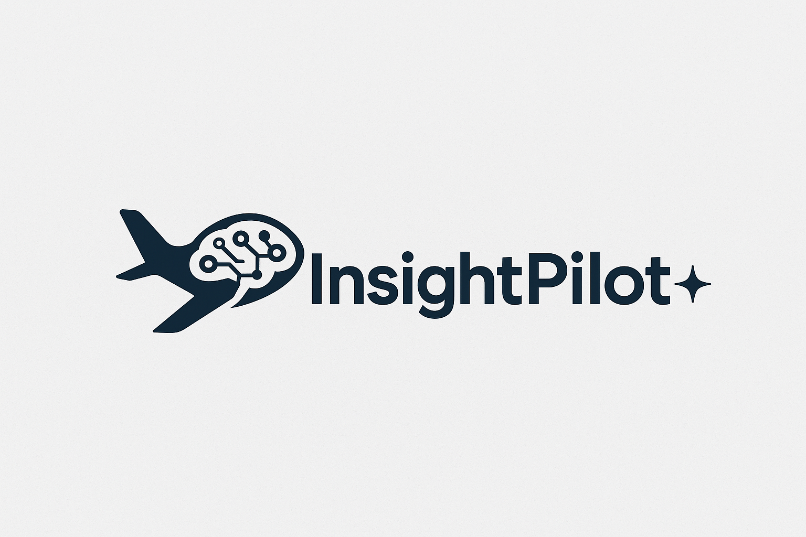
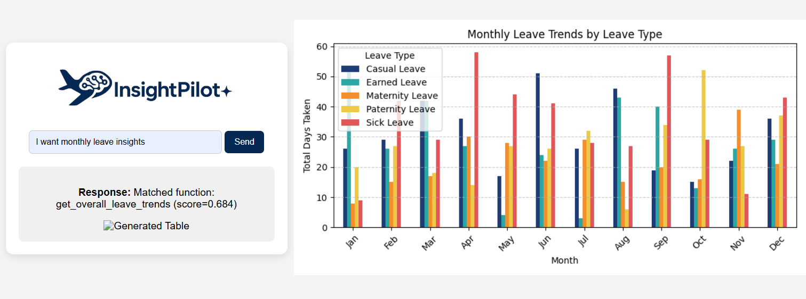

# **GOVHACK 2025**

## InsightPilot

#### What is InsightPilot?
InsightPilot An AI driven chatbot interface that allows dataset operations to be performed using natural language, helping users gain no-code insights from datasets.

#### How does it address the challenge?
It uses a QA Sentence Transformer from Hugging Face to interpret and map natural language queries such as "give me insights on sick leave usage" to predefined functions that interact with the dataset, which will pull up sick leave usage as a response. It provides transparency, as it shows the user what function it is picking, and how confident it is in its decision as a decimal score from 0 to 1.

## File Documentation

#### govhack_ml.py
Stores the multi-qa-MiniLM-L6-cos-v1 sentence transformer model, and a dictionary consisting of the function names, descriptions, and dummy queries used for model enrichment.
Contains the interpret_query() function called by the app to predict which function matches what the user is asking the best.

#### data_queries.py
Stores all the database query logic

#### csv_to_mongo.py
Unused in the final application
We were initially going to build our own model and use MongoDB to store training labels alongside data, but using the existing Hugging Face Q&A model was more time-efficient for our use case.
